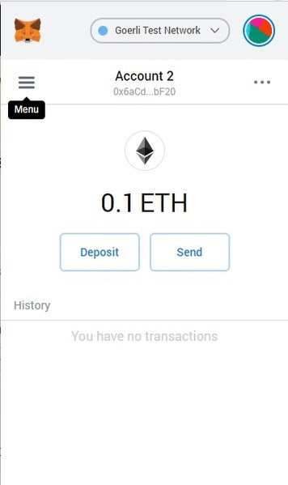
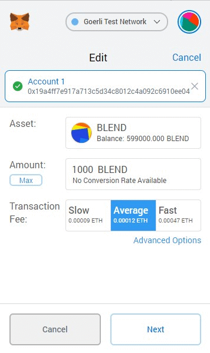

# StakerDAO BLND token

This project contains BLND token contract for StakerDAO project.
It also includes the controlling Multisig contract used by the Operations team to control the BLND token.

Contrary to other popular multisig initiatives on Ethereum, the supplied Multisig contract provides off-chain signing.
Exposing hashes of half-signed transactions on chain may influence the price of the BLND token.
Thus, we want signing to happen off-chain, so that hashes of half-signed transactions to appear on chain before execution.

## Installation

The project was tested with Node v12.\*.
It is strongly suggested that you use `nvm` to pick and install the required the node version.

Clone the repository and run `npm install -g` to make the `blend` command available in your PATH. Alternatively, you can install locally (`npm install`) but you would have to use `./bin/staker-blend` to call the CLI.

## CLI

### Prerequisites

The package provides a command line interface to deploy and upgrade the BLND token.
For convenience, some preset Ethereum network options are provided in Truffle configuration file: `truffle-config.js`. Currently, it contains configurations for local (`development`) and public (`goerly`) test networks. The configuration uses [Infura RPC](https://infura.io) to access public Ethereum networks.

To work with public networks (such as Goerli), you must supply the required environment variables, as specified in `.env.example`.

#### Local

To run against the local development network, you must have `ganache-cli` installed (`npm i -g ganache-cli`).

#### Goerli

To work with public networks (such as Goerli), you must supply the required environment variables, as specified in `.env.example`.
Also as an altenative to using `DEV_MNEMONIC` to specify account to send transaction from you can specify `DEV_SECRET_KEY`.
But make sure you specify only one of previous environment variables or runtime error would be raised.

### Deployment

To deploy the Multisig and the upgradeable BLND token contract, use the following command:

`blend deploy <owner1> <owner2> ... <ownerN>`

You will be asked for additional parameters in an interactive manner:

- `network` – one of the preconfigured networks to deploy to
- `threshold` – how many signatures are required in order to upgrade the BLND token contract later
- `minter` – the address that would hold BLND tokens initially
- `supply` – the initial supply that would be debited to `minter`

If you pick a `development` network, make sure you have `ganache-cli` running in the background.
If you pick `goerli` network, make sure to have all the variables from `.env.example` in your environment.

You can also provide these arguments via the corresponding command line options if you find this more convenient.

After deployment, you can check the deployed instances using `blend info`.
This command returns the information about Multisig and BLND token contracts such as multisig owners and token name along with the addresses of the instances.

### Upgrades

BLND contract upgrade is a multi-step process that looks as follows:

1. Someone (e.g., one of the owners) deploys a new _implementation_ to the Ethereum blockchain.
2. He then generates a _multisig transaction_ to point the BLND contract to the new implementation, and sends this not-yet-signed transaction to the multisig owners.
3. The owners _sign_ the transaction.
4. Once the signatures are collected, someone _submits_ the signed transaction to the network.

Once the transaction is submitted, the Multisig contract checks the signatures and upgrades the contract to the new implementation.

The CLI provides four commands to facilitate the process:

1. `blend upgrade` compiles the new implementation, uploads it to the Ethereum network, and creates a JSON file with a not-yet-signed multisig transaction.
2. `blend sign` signs the transaction JSON file.
3. `blend merge <file1> <file2> ... <fileN>` merges several transaction JSON files (possibly containing signatures from different owners) into one transaction JSON with all the signatures collected.
4. `blend submit` actually submits the signed transaction to the network and upgrades the implementation if all the signatures are correct and the threshold is met.

> **Note:** All the commands will ask for additional information such as input and output file names, the network to use, etc. Please, fill in the corresponding blanks. Alternatively, you can provide all the options straight away: see `blend <command> --help` for options description.

Thus, if you need to upgrade the BLND token contract, you should do the following:

1. Update the implementation and call `blend upgrade` to get a `tx.json` file.
2. Send this `tx.json` file to the multisig owners.
3. Ask the owners to call `blend sign tx.json` and send you the results back (`tx.alice.json`, `tx.bob.json`, etc.)
4. Merge the results you got from multisig owners via `blend merge tx.alice.json tx.bob.json -o tx.signed.json`
5. Send the signed transaction: `blend submit tx.signed.json`

## Using BLND token

### With _MetaMask_

To use BLND token, you'll need an ERC-20 compatible wallet.

1. Navigate to your wallet and find "Add custom token" button.
2. Type in the address, symbol and decimals of the BLND token (you can find this information with `blend info` command).
3. Click "Confirm".

See the process for Metamask wallet:

After these steps, you can send BLND token just like you send Ether or other ERC-20 tokens:

### With _OpenZeppelin_ CLI

_OpenZeppelin_ is supplied with pretty decent CLI which is capable of interacting with any ethereum contracts and have great UX.

To run _OpenZeppelin_ CLI you can use `npx oz` command. `npx oz call` command would call function name specified interactively and `npx oz send-tx` would also be helpful for sending transactions.
