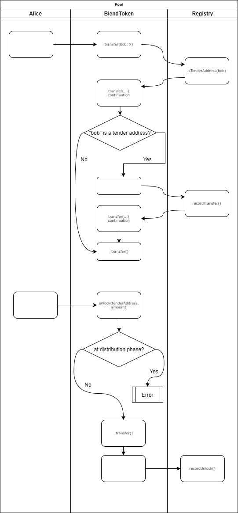
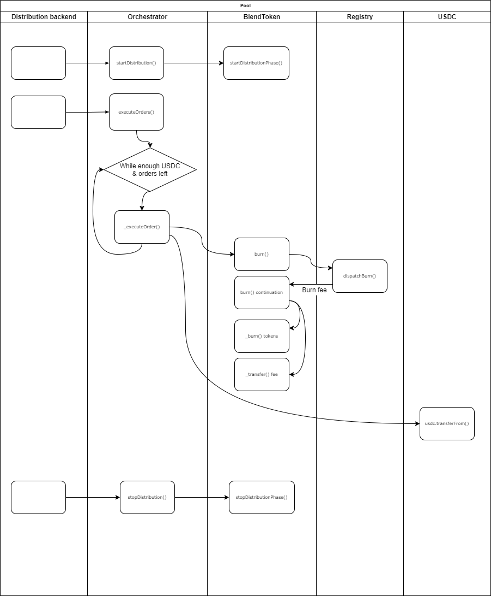
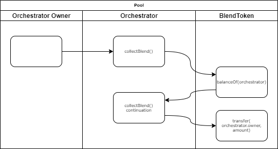

# StakerDAO Blend Architecture

## Token locks and unlocks
Every holder of BLEND tokens can lock his funds to participate in a tender offer.
To lock the funds, the token holder must first register a new special **tender address** via the provided user interface.
From the contracts' perspective, such tender address registration is implemented via a call to `registry.registerTenderAddress(tenderAddress)` from a pre-approved **registry backend**.

Note that this tender address is different from the user's Ethereum wallet address.
In fact, a user can have several wallet addresses that lock funds on the same tender address.

After getting a tender address, the user can send a simple ERC-20 `transfer()` to this tender address to lock tokens.
Such transfers are handled specially by the BlendToken contract – they are tracked in Registry and are eligible for reverse transactions – unlocks.

After locking the tokens, the user can either participate in a tender offer, or, alternatively, unlock his funds and get most part of his tokens back. "Most part" here means that there's a fee that must be left on the tender address (more on that in the Fees section).

Users can unlock their tokens via `blend.unlock()` method. Note that the Registry contract has a special logic for unlocks: if several addresses have sent tokens to the same tender address, the Registry would not allow one to unlock more than he has locked previously.



## Distribution mechanics
In a tender offer process, once the order book is collected off-chain, the backend stops accepting new orders and invokes `orchestrator.startDistribution()`.
Orchestrator contract notifies BlendToken that the distribution phase has started.
It means that token unlocks are not possible until the end of the distribution.
Token _burns_ are, in turn, allowed.

At this stage, USDC pool owner `approve`s the desired amount of USDC to the Orchestrator.

After the distribution is started, the backend submits the orders to the Orchestrator in batches using `orchestrator.executeOrders(...)` method. This method can be invoked several times with different set of orders, the only requirement is that the orders are sorted from the lowest price (USDC/BLEND) to the highest. The Orchestrator contract does not enforce the ordering between batches but it does enforce the ordering within a single batch.

For each order in a batch, the Orchestrator does the following:
1. Burns `amount` of BLEND from the tender address.
2. Transfers `price * amount` of USDC to the redeemer wallet.

If the USDC allowance is about to be exceeded at some point, the Orchestrator executes the order partially, i.e. it computes the amount of BLEND tokens it can buy with the current allowance, rounds the amount up and burns the corresponding amount of BLEND from the tender address.

For each burn operation, the dynamic fee is deduced.
The fee is computed by the Registry contract and depends on the number of addresses that locked the funds on the particular tender address.



## Fees

Registry contract tracks all the transactions to tender addresses.
If a transaction is made from a new address, this address is added to the **senders list** of the tender address.
For each sender, the **internal balance** is computed and updated.

When someone makes a transaction to a tender address (i.e. locks BLEND tokens), the internal balance of `(tenderAddress, sender)` is updated.
If one unlocks the funds, this internal balance is reduced by the unlocked amount.

During token burn, these internal balances are cleared up, starting from the most recent one.
A fee is deduced for each sender in the tender address' senders list that gets eliminated.

For example, if the internal balances of some tender address are `[(alice, 100), (bob, 9), (carol, 4)]`, the corresponding senders list (used for iteration) is `[alice, bob, carol]`, then, given `feePerAddress = 2` and `burnAmount = 10`, the process would go as follows:
1. Carol has 4 tokens on the tender address, we deduce 2 BLND fee and burn another 2 BLND => Carol is no longer in the list, we have 8 more BLEND tokens to distribute.
2. Bob has 9 tokens, so we deduce 2 BLND fee and burn 7 BLND => Bob is no longer in the list, we have 1 BLND to distribute.
3. Alice has 100 tokens, and it is more than the remaining burn amount => No fee for Alice is deduced, Alice remains in the list and has 99 tokens on her internal balance.

The resulting internal balances are `[(alice, 99)]`, and the senders list is just `[alice]`.

In case there's not enough tokens even to cover the fee, we remove the address from the list, clearing its entire internal balance.

The collected fees are sent to the Orchestrator contract.
The owner of the Orchestrator can then collect the fees using `orchestrator.collectBlend()` method.



## Contracts
### Blend Token
The contract is an upgradeable ERC-20 token with custom `transfer` and `transferFrom` logic.

The contract has an owner. The owner can be updated via a two-step updating approach (`transferOwnership` + `acceptOwnership`).

Storage:
* `public address orhestrator`
* `public address registry`

Methods:
1. `setRegistry(address newRegistry)`
   - **Behavior:** Updates the address of the registry contract
   - **Access:** only **owner**
   - **Exceptions:**
      - Ownable: caller is not the owner

2. `setOrchestrator(address newOrchestrator)`
   - **Behavior:** Updates the address of the orchestrator contract
   - **Access:** only **owner**
   - **Exceptions:**
      - Ownable: caller is not the owner

3. `transfer(address to, unit256 amount) -> bool`
   - **Behavior:** Transfers tokens (possibly to a tender address)
      - if `registry.isTenderAddress(to)`, then `registry.recordTransfer(sender, to, amount)`
   - **Access:** anyone
   - **Exceptions (own):**
      - Not enough tokens
      - Overflow
   - **Exceptions (from Registry):**
      - The amount must not be less than minimum (if the amount is less than the current fee)
      - Overflow

2. `transferFrom(address from, address to, uint256 amount) -> bool`
   - **Behavior:** Transfers tokens (possibly to a tender address)
      - if `registry.isTenderAddress(to)`, then `registry.recordTransfer(from, to, amount)`
   - **Access:** anyone
   - **Exceptions (own):**
      - Not enough tokens
      - Not enough allowance
      - Overflow
   - **Exceptions (from Registry):**
      - The amount must not be less than minimum (if the amount is less than the current fee)
      - Overflow

3. `unlock(address tenderAddress, uint256 amount)`:
   - **Behavior:** Unlocks funds from a tender address.
      - You are only allowed to unlock no more than you have locked previously (i.e. registry tracks the amounts sent by a particular address and does not allow to unlock more than that value). In practice it means that if you have two addresses (alice and bob), you can't send the `lock` transaction from `alice` and the `unlock` transaction from `bob`. This is done to prevent unauthorized unlocks in case some old key gets compromised.
      - Upon unlocking the funds, you MUST leave at least the fee amount on the tender address.
      - If the token is at distribution phase, you cannot unlock funds.
   - **Access:** anyone
   - **Exceptions:**
      - Cannot unlock funds at distribution phase
      - Not enough tokens
   - **Exceptions (from Registry):**
      - Tender address is not registered
      - Insufficient locked amount
      - You must leave the fee on the tender address (if the amount left on `tenderAddress` is less than the current fee)

5. `startDistributionPhase()`
   - **Behavior:**
      - Disallow unlocks
      - Allow burnouts
      - Do nothing if already at distribution phase
   - **Access:** only `orhestrator`
   - **Exceptions:**
      - Unauthorized: sender is not the Orchestrator

6. `stopDistributionPhase()`
   - **Behavior:**
      - Allow unlocks
      - Disallow burnouts
      - Do nothing if already at regular phase
   - **Access:** only `orhestrator`
   - **Exceptions:**
      - Unauthorized: sender is not the Orchestrator

7. `burn(address tenderAddress, uint256 amount)`
   - **Behavior:** Burns tokens from the tender address and sends the fees to the Orchestrator. Notifies the registry that the burn has occurred; the fees are computed by the registry.
   - **Access:** only `orhestrator`
   - **Exceptions (own):**
      - Burn is allowed only at distribution phase
      - Unauthorized: sender is not the Orchestrator
   - **Exceptions (from Registry):**
      - Burning from regular addresses is not allowed
      - Not enough balance on tender address
      - Overflow

### Registry

The contract is upgradeable.

The contract has an owner. The owner can be updated via a two-step updating approach (`transferOwnership` + `acceptOwnership`).

Storage:

* `address public registryBackend`
* `address public blend`
* `uint256 public feePerAddress` – the fee deduced for removing a source wallet from `_senders[tenderAddress]` list during burns, is used to prevent denial-of-service attacks on distribution;
* `mapping (address => bool) private _tenderAddresses` – whether some address is a registered tender address;
* `mapping (address => mapping (address => uint256)) private _balances` – tenderAddress to source wallet to balance relation;
* `mapping (address => address[]) private _senders` – list of source wallets that have nonzero `_balances[tenderAddress][wallet]` value, i.e. those who have sent tokens to this tender address, and whose tokens have not been burnt yet;

State-modifying methods:
1. `setRegistryBackend(address newBackend)`
   - **Behavior:** Sets a new registry backend address. Registry backend can set fees and register new tender addresses.
   - **Access:** only **owner**
   - **Exceptions:**
      - Ownable: caller is not the owner
2. `setFeePerAddress(uint256 newFee)`
   - **Behavior:** Sets a new `feePerAddress` for burning the tokens from a tender address. The fee is also the minimum amount of tokens one has to send to a tender address or leave on a tender address while unlocking the funds.
   - **Access:** only **Registry backend**
   - **Exceptions:**
      - Unauthorized: sender is not a registry backend
3. `recordTransfer(address from, address tenderAddress, uint256 amount)`
   - **Behavior:** Records a transfer from a regular wallet to a tender address.
   - **Access:** only `blend`
   - **Exceptions:**
      - Tender address is not registered
      - The amount must not be less than minimum (if the amount is less than the current fee)
      - Unauthorized: sender is not a Blend token contract
      - Overflow
4. `recordUnlock(address tenderAddress, address to, uint256 amount)`
   - **Behavior:** Records an unlock transaction that returns funds from a tender address. Fails if there are not enough funds to unlock. Requires that at least `feePerAddress` remains locked and associated with the sender's internal balance.
   - **Access:** only `blend`
   - **Exceptions:**
      - Tender address is not registered
      - Insufficient locked amount
      - You must leave the fee on the tender address (if the amount left on `tenderAddress` is less than the current fee)
5. `dispatchBurn(address tenderAddress, uint256 orderAmount) -> (uint256 totalFee)`
   - **Behavior:**
      Reduces the internal "balances" of the token senders upon burn, i.e. makes `sum(_balances[tenderAddress])` equal to the tender address balance. During this operation, we traverse through senders' balances starting from the latest one and deduce either:
      - the total internal balance AND a fee for removing the address from the senders list
      - the remaining order amount – in this case the sender remains in the list and the fee is not taken.

      The method returns the total fee for all the addresses removed from `_senders[tenderAddress]`.
      Note that this fee may be less than `feePerAddress * removedAddressesCount` because in case we increase `feePerAddress` the internal balances of the senders may become less than the new fee. In this case, the whole balance is added to the total fee and the sender is removed from the list.
   - **Access:** only `blend`
   - **Exceptions:**
      - Unauthorized: sender is not a Blend token contract
      - Burning from regular addresses is not allowed
      - Not enough balance on tender address
      - Overflow
6. `registerTenderAddress(address tenderAddress)`
   - **Behavior:** Adds an address to the set of registered tender addresses.
   - **Access:** only **Registry backend**
   - **Exceptions:**
      - Tender address already registered
      - Unauthorized: sender is not a registry backend

View methods:
1. `isTenderAddress(address tenderAddress) -> bool`
   - **Behavior:** Returns whether `tenderAddress` is a registered tender address.
   - **Access:** anyone
   - **Exceptions:** none
2. `getLockedAmount(address tenderAddress, address wallet) -> uint256`
   - **Behavior:** Returns `_balances[tenderAddress][wallet]`.
   - **Access:** anyone
   - **Exceptions:** none
3. `getSendersCount(address tenderAddress) -> uint`
   - **Behavior:** Returns the number of addresses that have sent BLEND to the specified tender address AND are still eligible to unlock some nonzero amount of BLEND tokens (i.e. the length of `_senders[tenderAddress]` list).
   - **Access:** anyone
   - **Exceptions:** none
4. `getSender(address tenderAddress, uint i) -> address`
   - **Behavior:** Returns the i-th sender from the tender address' senders list.
   - **Access:** anyone
   - **Exceptions:**
      - Index out of range

### Orchestrator
The contract is **not** upgradeable.

The contract has an owner. The owner can be updated via a two-step updating approach (`transferOwnership` + `acceptOwnership`).

Types:
```cpp
struct Order {
    address redeemerTenderAddress;
    address redeemerWallet;
    uint256 price;
    uint256 amount;
}
```

Storage:
* `public address usdc`
* `public address blend`
* `public address registry`
* `public address distributionBackend`
* `public address usdcPool`

State-modifying methods:
1. `setDistributionBackend(address newBackend)`
   - **Behavior:**
      - `distributionBackend = newBackend`
   - **Access:** only **owner**
   - **Exceptions:**
      - Unauthorized
2. `setUsdcPool(address pool)`
   - **Behavior:**
      - `_usdcPool = pool`
   - **Access:** only **owner**
   - **Exceptions:**
      - Unauthorized
3. `startDistribution()`
   - **Behavior:**
      - `blend.startDistributionPhase()`
   - **Access:** only **Distribution backend**
   - **Exceptions:**
      - Unauthorized: sender is not a distribution backend
4. `stopDistribution()`
   - **Behavior:**
      - `blend.stopDistributionPhase()`
   - **Access:** only **Distribution backend**
   - **Exceptions:**
      - Unauthorized: sender is not a distribution backend
5. `executeOrders(Order[] orders)`
   - **Behavior:** Executes orders from lowest price to highest. If there is not enough USDC, the order is executed partially. In case of other errors, the transaction fails.
      - WHILE
         - there are orders remaining
         - AND there is some USDC left
         - AND there is some USDC allowance left
      - DO:
         - If the order can only be executed partially because there is not enough USDC or USDC allowance, adjust amounts:
            - `usdcAmount = min(<usdc left>, <allowance left>)`
            - `blendAmount = ceiling(usdcAmount / order.price)`
         - Otherwise:
            - `usdcAmount = order.amount * order.price`
            - `blendAmount = order.amount`
         - `usdc.transferFrom(usdcPool, order.redeemerWallet, usdcAmount)`
         - `blend.burn(order.redeemerTenderAddress, blendAmount)`
      - **Note that this function should treat `order.price` as a value with 4 decimal points and adjust the arithmetic operations accordingly.**
   - **Access:** only **Distribution backend**
   - **Exceptions (own):**
      - Current phase does not allow distribution
      - Unauthorized: sender is not a distribution backend
      - Orders must be sorted
      - Overflow
   - **Exceptions (from Registry):**
      - Burning from regular addresses is not allowed
      - Not enough balance on tender address
      - Overflow
6. `collectBlend()`
   - **Behavior:** Sends all BLEND tokens associated with the Orchestrator to the owner of the contract.
   - **Access:** only **owner**
   - **Exceptions:**
      - Ownable: caller is not the owner
